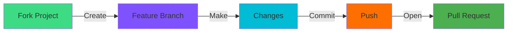

<div align="center">


<br/>

### 📝 Modern Task Management | ✨ Beautiful & Intuitive UI | 🚀 Fast & Lightweight

<br/>

[](https://www.android.com/)
[](https://kotlinlang.org/)
[](LICENSE)
[](https://android-arsenal.com/api?level=21)
[](https://github.com/koushik4475/TO-DO-APPLICATION-HY_KOUSHIK/stargazers)

<br/>

<br/>


<br/>
<br/>

</div>

---

<div align="center">

## ✨ Features


</div>

<table>
<tr>
<td width="50%">

### 🎯 **Core Functionality**
- ✅ Create, edit, and delete tasks effortlessly
- 📋 Organize tasks with categories
- ⏰ Set reminders and due dates
- 🎨 Clean and intuitive user interface
- 💾 Local data persistence

</td>
<td width="50%">

### 🔥 **Advanced Features**
- 🌙 Dark mode support
- 🔔 Push notifications
- 📊 Task completion tracking
- 🔍 Search and filter tasks
- 🎭 Priority levels (High, Medium, Low)

</td>
</tr>
</table>

<div align="center">

</div>

---

<div align="center">

## 🛠️ Built With


</div>

<div align="center">

| Technology | Purpose |
|:----------:|:-------:|
|  | Development Environment |
|  | Programming Language |
|  | UI Design |
|  | Local Database |
|  | Design System |


</div>

---

<div align="center">

## 🚀 Getting Started


</div>

### Prerequisites

```bash
• Android Studio Arctic Fox or later
• Android SDK 21+
• Kotlin 1.5+
• Gradle 7.0+
```

### Installation

1. **Clone the repository**
   ```bash
   git clone https://github.com/koushik4475/TO-DO-APPLICATION-HY_KOUSHIK.git
   ```

2. **Open in Android Studio**
   ```
   File → Open → Select the cloned directory
   ```

3. **Sync Gradle**
   ```
   Wait for Gradle to sync all dependencies
   ```

4. **Run the app**
   ```
   Click the 'Run' button or press Shift + F10
   ```

---

## 📂 Project Structure

```
TO-DO-APPLICATION-HY_KOUSHIK/
│
├── app/
│   ├── src/
│   │   ├── main/
│   │   │   ├── java/
│   │   │   │   └── com.example.todo/
│   │   │   │       ├── activities/
│   │   │   │       ├── adapters/
│   │   │   │       ├── database/
│   │   │   │       ├── models/
│   │   │   │       └── utils/
│   │   │   ├── res/
│   │   │   │   ├── layout/
│   │   │   │   ├── drawable/
│   │   │   │   ├── values/
│   │   │   │   └── menu/
│   │   │   └── AndroidManifest.xml
│   │   └── test/
│   └── build.gradle
│
├── gradle/
├── .gitignore
├── build.gradle
└── README.md
```

---

<div align="center">

## 🎨 Design Philosophy


</div>

<div align="center">

> *"Simplicity is the ultimate sophistication"* - Leonardo da Vinci

</div>

Our design focuses on:
- **Minimalism** - Clean interfaces without clutter
- **Intuitive Navigation** - Users know where to go instinctively
- **Visual Hierarchy** - Important information stands out
- **Responsive Design** - Smooth animations and transitions
- **Accessibility** - Usable by everyone

<div align="center">

</div>

---

## 🔧 Key Components

### Architecture
```
MVVM (Model-View-ViewModel) Pattern
├── Model: Data layer (SQLite Database)
├── View: UI layer (Activities/Fragments)
└── ViewModel: Business logic layer
```

### Database Schema
```sql
Tasks Table:
├── id (Primary Key)
├── title
├── description
├── priority
├── due_date
├── is_completed
└── created_at
```

---

<div align="center">

## 🌟 Highlights


</div>

<div align="center">

### 🎯 Why This App?

| Feature | Benefit |
|---------|---------|
| 🚀 **Fast & Lightweight** | Minimal app size, maximum performance |
| 🔒 **Privacy First** | All data stored locally on your device |
| 🎨 **Beautiful UI** | Material Design principles |
| 🔄 **No Ads** | Distraction-free experience |
| 💯 **Free & Open Source** | Forever free, community-driven |


</div>

---

## 📊 App Statistics

<div align="center">


</div>

---

<div align="center">

## 🤝 Contributing


</div>

Contributions are what make the open-source community amazing! Any contributions you make are **greatly appreciated**.

<div align="center">



</div>

1. Fork the Project
2. Create your Feature Branch (`git checkout -b feature/AmazingFeature`)
3. Commit your Changes (`git commit -m 'Add some AmazingFeature'`)
4. Push to the Branch (`git push origin feature/AmazingFeature`)
5. Open a Pull Request

<div align="center">

</div>

---

## 📝 License

Distributed under the MIT License. See `LICENSE` for more information.

---

<div align="center">

## 👨‍💻 Developer


### **Koushik**


[](https://github.com/koushik4475)
[](https://linkedin.com)
[](mailto:your.email@example.com)


</div>

---

<div align="center">

## 📞 Support

If you like this project, please consider:

<br/>

⭐ **Starring** this repository &nbsp; | &nbsp; 🐛 **Reporting** bugs and issues

💡 **Suggesting** new features &nbsp; | &nbsp; 🤝 **Contributing** to the codebase

<br/>


</div>

---

<div align="center">

## 🙏 Acknowledgments


- Material Design Icons
- Android Developer Documentation
- Stack Overflow Community
- All Contributors


</div>

---

<div align="center">


### 💙 Made with passion and ☕

<br/>

**© 2024 Koushik. All Rights Reserved.**


</div>
